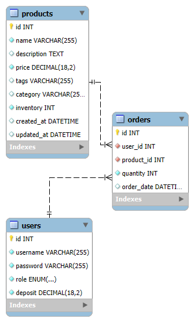

# TODO
- Improve code readability.

# ruili-project1
- A market website with account system.

### Database
**Table: users**
- id: int, primary key
- username: varchar(255), unique, not null
- password: varchar(255), not null
- role: enum('user', 'admin'), not null
- deposit: decimal(10, 2), default 0.0

**Table: products**
- id: int, primary key
- name: varchar(255), nut null
- price: decimal(13, 2), not null
- storage: int, not null
- category VARCHAR(255)
- description TEXT

**Table: orders**
- id: int, primary key
- user_id: int, not null, references users(id), on delete/update cascade
- product_id: int, not null, references product(id), on delete/update cascade
- quantity: int, not null
- order_date: datetime, not null, default current_timestamp

### Database ERD 

### Web Page
**Login and register page**
- Login
  - check if user logged in
  - if not, ask user to log in
  - send request and password to server, check and login
- register
  - take username and password, send to server to register

**Welcome page**
- Show products, price, quantity
- Can purchase product.
- Can add deposit.

**Order history page**
- can check user's order history

**Admin page**
- Can check all existing users and change update role, delete account.
- can check all user's order history.
- can check all products, modify quantity and price.
- can add new product.
- can update and delete product.

